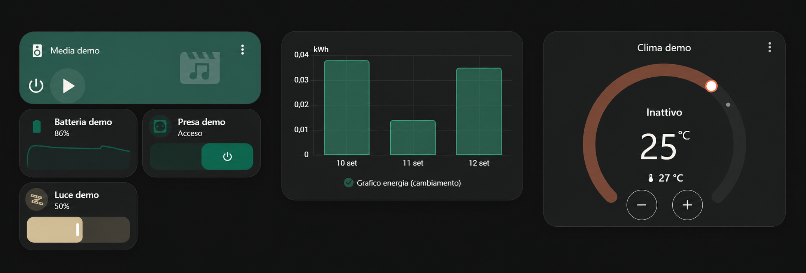
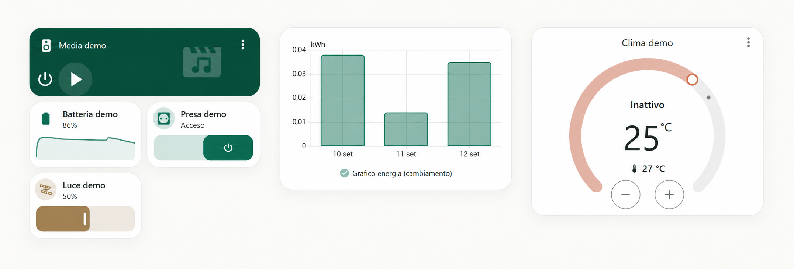

# Edera

Tema per Home Assistant con modalità **Light** e **Graphite Dark**, progettato per avere un'interfaccia pulita, coerente e leggibile.





## Sicurezza e privacy

Edera è **solo un tema grafico** e non richiede accesso ai dispositivi o ai dati personali della tua installazione.

Non richiede password, token, API key, indirizzi IP o credenziali Home Assistant. Il repository pubblico non contiene configurazioni della casa, entity_id personali, dati di rete o altre informazioni private.

L'installazione del tema non modifica automazioni, dispositivi o logiche di sicurezza.

## Caratteristiche

- Light + Graphite Dark
- colori semantici per distinguere rapidamente gli stati
- luci Warm Ivory / Brass
- dispositivi attivi Emerald
- media Petrol
- colori dedicati per clima, warning e allarmi
- palette coordinata per i grafici
- font di sistema, senza font esterni
- compatibile con le card native di Home Assistant
- Bubble Card, Mushroom e card-mod opzionali

## Installazione

### HACS

Aggiungi il repository Edera come **Theme** nei repository personalizzati di HACS e installalo.

### Manuale

Copia:

```text
themes/edera.yaml
```

in:

```text
/config/themes/
```

e assicurati che in `configuration.yaml` sia presente:

```yaml
frontend:
  themes: !include_dir_merge_named themes
```

Poi ricarica i temi da Home Assistant.

## Logica dei colori

| Categoria | Colore |
|---|---|
| Dispositivo attivo | Emerald |
| Luce accesa | Warm Ivory / Brass |
| Media | Petrol |
| Riscaldamento | Terracotta |
| Raffrescamento | Soft Blue |
| Warning | Amber |
| Allarme / problema critico | Alert Red |
| Spento / inattivo | Neutral |

## Componenti opzionali

Edera funziona **senza dipendenze custom**.

Bubble Card, Mushroom e card-mod possono essere utilizzati per ottenere personalizzazioni aggiuntive, ma non sono necessari per il tema base e possono richiedere manutenzione dopo aggiornamenti di Home Assistant.

## Licenza

Edera può essere utilizzato gratuitamente per uso personale e non commerciale.

La vendita, rivendita e distribuzione commerciale non sono consentite senza autorizzazione.

Consulta `LICENSE` per i termini completi.

## Versione

**Edera 1.0.0**
