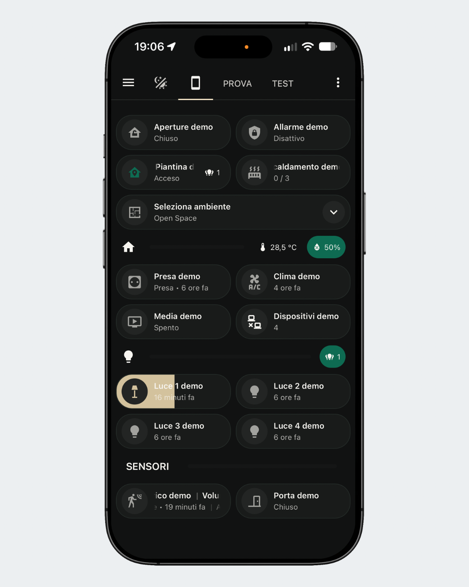
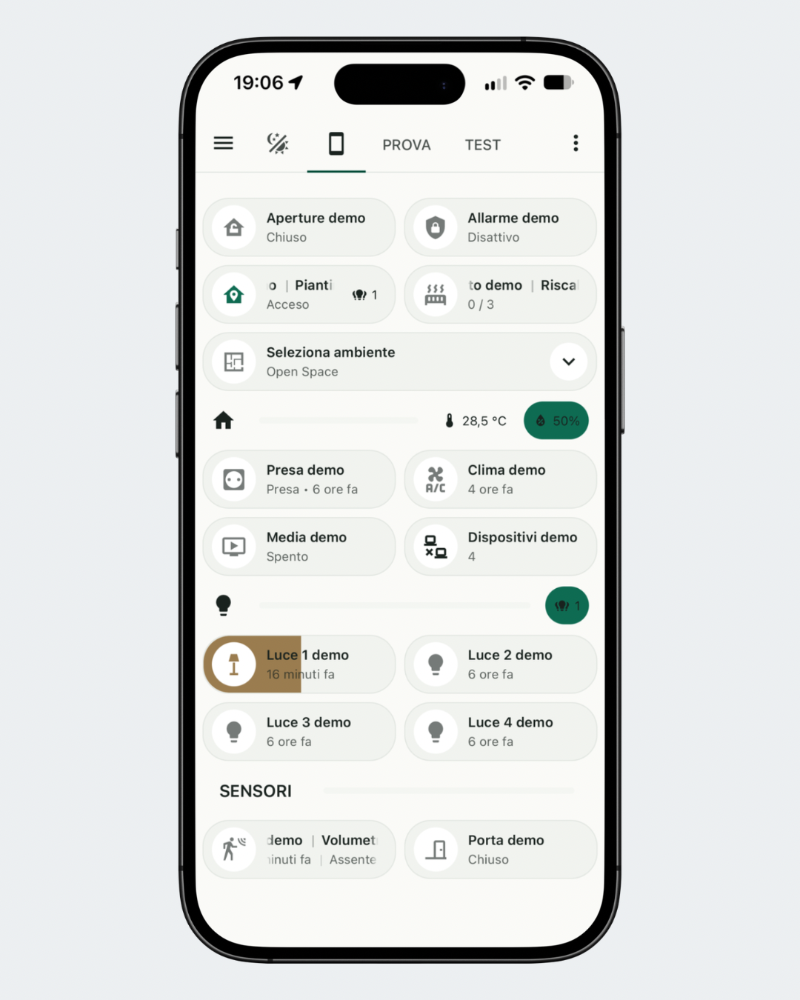

# Edera

## Apri Home Assistant. Il resto può aspettare.

Edera è un tema **Light + Graphite Dark** pensato per rendere l’esperienza Home Assistant piacevole, armoniosa e immediatamente leggibile — su smartphone, tablet e desktop.

**Light + Graphite Dark · Colori semantici · Nessuna dipendenza custom obbligatoria**

## Edera sul tuo smartphone

| Graphite Dark | Light |
| --- | --- |
|  |  |

Edera mantiene la stessa identità visiva su tutti i dispositivi, con particolare attenzione alla leggibilità degli stati anche sugli schermi più piccoli.

> **Sicurezza e privacy**
>
> Edera è esclusivamente un tema grafico per Home Assistant.
>
> Non accede a dispositivi, automazioni, credenziali, token, indirizzi IP o dati personali e non modifica le logiche della tua installazione.
>
> Non utilizza servizi cloud o font esterni e non richiede componenti custom per funzionare.

> **Le dashboard nelle immagini sono esempi dimostrativi.**
>
> Edera modifica l'aspetto di Home Assistant, ma non installa automaticamente dashboard, card o layout.

## Provalo subito

### Installazione manuale

[**Scarica Edera — `edera.yaml`**](https://raw.githubusercontent.com/luigi-regolo/Edera/main/themes/edera.yaml)

Copia il file in:

```text
/config/themes/edera.yaml
```

Se la cartella dei temi non è già configurata, assicurati che in `configuration.yaml` sia presente:

```yaml
frontend:
  themes: !include_dir_merge_named themes
```

Poi ricarica i temi o riavvia Home Assistant e seleziona **Edera** dal tuo profilo.

### HACS — archivio personalizzato

1. Apri **HACS**
2. Vai su **Archivi digitali personalizzati**
3. Aggiungi:

   `https://github.com/luigi-regolo/Edera`

4. Seleziona **Tema**
5. Cerca **Edera** e installalo

## Non solo estetica

In Edera il colore comunica lo stato.

| Stato | Colore |
| --- | --- |
| Dispositivo attivo | Emerald |
| Luce accesa | Warm Ivory / Brass |
| Media | Petrol |
| Riscaldamento | Terracotta |
| Raffrescamento | Soft Blue |
| Warning | Amber |
| Allarme / problema critico | Alert Red |
| Spento / inattivo | Neutral |

L'obiettivo è rendere lo stato della casa riconoscibile con uno sguardo, senza trasformare la dashboard in un insieme di colori casuali.

## In breve

- modalità **Light** e **Graphite Dark**
- progettato per smartphone, tablet e desktop
- colori semantici per distinguere rapidamente gli stati
- palette coordinata per i grafici
- font di sistema
- nessun font esterno
- compatibile con le card native di Home Assistant
- nessuna dipendenza custom obbligatoria

## Anteprima desktop

| Graphite Dark | Light |
| --- | --- |
|  |  |

## Componenti opzionali

Edera funziona senza dipendenze custom.

**Bubble Card**, **Mushroom** e **card-mod** possono essere utilizzati per personalizzazioni aggiuntive, ma non sono necessari per il funzionamento del tema base.

Sono componenti di terze parti e possono richiedere manutenzione o aggiornamenti dopo modifiche a Home Assistant.

## Licenza

Edera è distribuito con licenza **GNU General Public License v3.0 (GPL-3.0)**.

La licenza consente uso, modifica e redistribuzione, anche commerciale, nel rispetto dei termini della GPL v3.0.

Consulta [LICENSE](LICENSE) per i termini completi.

## Versione

**Edera 1.0.0**
